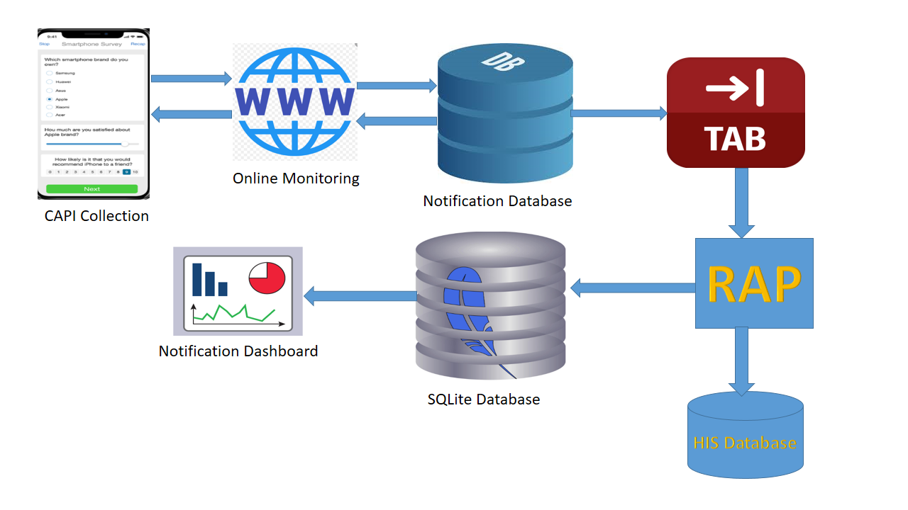

 

             

# A Reproducible Analytical Pipeline for the - Notifiable Disease Notification

This Reproducible Analytical Pipeline is majorly for the purpose of processing the data collected by the health facilities around Vanuatu especially through filling up the Notifiable Disease Notification CAPI application.

